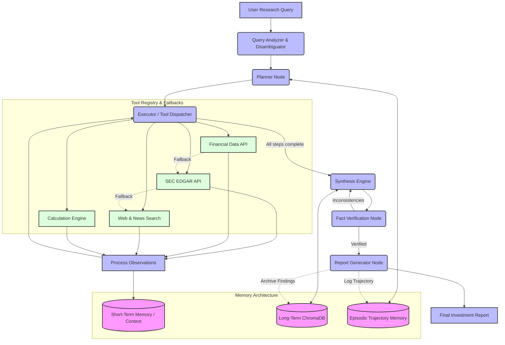

# Autonomous Financial Research Agent (ARA-1)


An autonomous AI agent that replicates the research workflow of a junior financial
analyst. Given a natural-language query, it independently formulates a research
plan, gathers data from multiple sources (SEC EDGAR filings, financial-data APIs,
earnings transcripts, news, and web search), resolves conflicting information, and
synthesises a structured investment-research report — without step-by-step human
guidance.

Built for **Zetheta Project 1A** ("Agentic AI — Autonomous Financial Research
Agent with Multi-Source Synthesis").

---

## Table of Contents
- [What it does](#what-it-does)
- [Key features](#key-features)
- [Architecture](#architecture)
- [LLM-optional design](#llm-optional-design)
- [Project structure](#project-structure)
- [Setup](#setup)
- [Usage](#usage)
- [The 8 validation challenges](#the-8-validation-challenges)
- [Evaluation results](#evaluation-results)
- [Tool registry](#tool-registry)
- [Testing](#testing)
- [Limitations](#limitations)

---

## What it does

You give it a query like *"Produce a comprehensive risk assessment for Tesla Inc."*
and it:

1. **Analyses** the query — classifies intent (profile, earnings, risk, comparison,
   contradiction, ambiguous, sector, full report) and resolves company names to
   tickers.
2. **Plans** a sequence of concrete tool calls tailored to that intent.
3. **Executes** the plan against live data sources, with circuit breakers and
   fallback chains protecting every call.
4. **Synthesises** the gathered data, applying a source-reliability hierarchy
   (SEC filings > financial APIs > news) to resolve conflicts.
5. **Verifies** key claims, then **generates** a sourced, sectioned Markdown report
   plus a full execution trace.

## Key features

- **Plan-and-Execute reasoning loop** built on [LangGraph](https://github.com/langchain-ai/langgraph) (6-node directed graph).
- **12-tool registry** with JSON-schema validation and dispatch (exceeds the 10-tool minimum).
- **3-layer memory:** short-term graph state, long-term semantic memory (ChromaDB),
  and episodic trajectory logging — long-term memory persists across challenges so
  the agent can reason over companies it researched earlier.
- **Multi-source synthesis** with conflict resolution by source tier.
- **Resilience:** circuit breakers + multi-step fallback chains; a configurable
  failure-injection harness for stress testing.
- **No fabrication:** every figure traces to a real source; unavailable data is
  labelled explicitly rather than invented.
- **Evaluation framework:** deterministic metrics computed from real execution
  traces, plus an LLM-as-a-judge hook.

## Architecture

The cognitive loop is a 6-node LangGraph state machine:

```
Query Analyzer → Planner → Executor ⟲ → Synthesizer → Fact Verifier → Report Generator
                              (loop until plan complete or 20-call budget hit)
```

| Node | Responsibility | Code |
|------|----------------|------|
| Query Analyzer | Classify intent, resolve tickers, disambiguate vague queries | `agent/query_analyzer.py`, `agent/ticker_resolver.py`, `agent/disambiguation.py` |
| Planner | Build a concrete tool-call plan from the intent | `agent/core.py` |
| Executor | Dispatch each tool call with circuit breakers + fallbacks | `agent/core.py`, `agent/error_handler.py`, `agent/circuit_breaker.py`, `agent/fallback_chains.py` |
| Synthesizer | Weave observations into a narrative; resolve conflicts | `synthesis/engine.py`, `synthesis/conflict_resolver.py`, `synthesis/narrative.py`, `synthesis/data_formatters.py` |
| Fact Verifier | Cross-check headline claims | `tools/fact_checker.py` |
| Report Generator | Assemble sourced, sectioned report + execution trace | `agent/core.py`, `tools/report_gen.py` |

### Diagram



See [`docs/architecture_specification_final.md`](docs/architecture_specification_final.md)
for the full technical spec.

## LLM-optional design

The agent runs **with or without an LLM API key**:

- **With a key** (`ANTHROPIC_API_KEY` or `OPENAI_API_KEY`): the Planner and
  Synthesizer use the model for reasoning and analyst-grade narrative prose.
- **Without a key** (the default in this repo's published runs): a deterministic
  planner derives tool calls from query intent, and a deterministic synthesizer
  assembles **live data** (yfinance financials/profiles/news, SEC EDGAR full-text
  search) into structured, sourced sections. Output is a factual data brief rather
  than flowing prose — but it is real and grounded, not mock.

Dropping a key into `.env` auto-upgrades the same pipeline to LLM narrative; no
code changes required.

## Project structure

```
.
├── agent/                      # Core reasoning pipeline
│   ├── core.py                 # 6-node LangGraph agent (entry point: FinancialResearchAgent)
│   ├── query_analyzer.py       # Intent + complexity classification
│   ├── ticker_resolver.py      # Company-name → ticker, intent heuristics
│   ├── disambiguation.py       # Resolves vague queries, records assumptions
│   ├── prompts.py              # LLM prompts (planner / synthesizer)
│   ├── parser.py               # Parses LLM plan output
│   ├── error_handler.py        # Orchestrates retries + breakers + fallbacks
│   ├── circuit_breaker.py      # Per-tool circuit breaker
│   └── fallback_chains.py      # Fallback tool cascades
├── tools/                      # Tool registry (12 tools)
│   ├── tool_registry.py        # Schema validation + dispatch
│   ├── schemas/tool_schemas.py # JSON schemas for all tools
│   ├── sec_edgar.py            # SEC EDGAR full-text search (live)
│   ├── financial_api.py        # Financial statements via yfinance (live)
│   ├── company_profile.py      # Company metadata via yfinance (live)
│   ├── news_sentiment.py       # News + TextBlob sentiment via yfinance (live)
│   ├── earnings.py             # Earnings transcripts (FMP, key-gated)
│   ├── peer_comparison.py      # Peer metrics (FMP, key-gated)
│   ├── web_search.py           # Web search (Tavily, key-gated)
│   ├── calculator.py           # Deterministic financial calculations
│   ├── fact_checker.py         # Claim cross-referencing
│   ├── report_gen.py           # Report formatting
│   ├── memory_tools.py         # vector_db_search / vector_db_store wrappers
│   └── stubs.py                # Mock fallbacks for offline/no-key runs
├── memory/                     # 3-layer memory system
│   ├── vector_store.py         # Long-term semantic memory (ChromaDB)
│   ├── episodic.py             # Episodic trajectory log
│   └── context_manager.py      # Short-term context compression (tiktoken)
├── synthesis/                  # Multi-source synthesis engine
│   ├── engine.py               # Orchestrates synthesis
│   ├── conflict_resolver.py    # Source-reliability-tier conflict resolution
│   ├── narrative.py            # Narrative threading
│   └── data_formatters.py      # Live tool JSON → readable report sections
├── evaluation/                 # Evaluation framework
│   ├── metrics.py              # Deterministic metrics + LLM-judge hook
│   ├── generate_evaluation.py  # Generates eval reports from real run traces
│   ├── dashboard.py            # Summary dashboard
│   └── benchmarks/             # Gold-standard baselines (MSFT, AAPL, TSLA)
├── tests/                      # Pytest suite (16 tests)
├── results/                    # Generated outputs (8 challenges + eval reports)
├── docs/                       # Architecture spec, trace gallery, optimization log, final report
├── run_all_challenges.py       # Runs all 8 challenges → results/
├── run_challenge_8.py          # Runs the degradation challenge alone
├── requirements.txt
├── setup.py
└── .env.example
```

## Setup

Requires Python 3.10+.

```bash
# 1. Create and activate a virtual environment
python -m venv venv
source venv/bin/activate          # Windows: venv\Scripts\activate

# 2. Install the package (editable) and dependencies
pip install -e .

# 3. (Optional) enable LLM narrative + key-gated tools
cp .env.example .env              # then fill in any keys you have
```

API keys are **all optional**. Without them the agent uses live keyless sources
(yfinance, SEC EDGAR) and deterministic synthesis. Supported keys:
`ANTHROPIC_API_KEY` / `OPENAI_API_KEY` (LLM narrative), `TAVILY_API_KEY` (web
search), `FMP_API_KEY` (earnings transcripts, peer comparison).

## Usage

**Run all 8 challenges** (writes `results/challenge_1..8.md` + `results/run_summary.json`):
```bash
python run_all_challenges.py
```

**Run the degradation stress challenge alone** (50% simulated tool failure):
```bash
python run_challenge_8.py
```

**Generate the evaluation reports** from the latest run:
```bash
python -m evaluation.generate_evaluation
```

**Use the agent programmatically:**
```python
from agent.core import FinancialResearchAgent

agent = FinancialResearchAgent()                  # no LLM → deterministic live-data mode
result = agent.run("Produce a risk assessment for Tesla Inc.")
print(result["report"])                           # Markdown report
print(result["trace"])                            # execution trace

# With an LLM and/or the degradation harness:
# agent = FinancialResearchAgent(llm=my_llm, failure_rate=0.5)
```

## The 8 validation challenges

| # | Challenge | Difficulty | What it tests |
|---|-----------|------------|---------------|
| 1 | Microsoft company profile | 1/5 | Basic data gathering + profile |
| 2 | Apple quarterly earnings analysis | 2/5 | Earnings workflow, transcript handling |
| 3 | Tesla risk assessment | 2/5 | SEC risk factors + breadth of risk coverage |
| 4 | AWS vs Azure vs GCP comparison | 3/5 | Multi-company comparison, peer metrics |
| 5 | Palantir contradiction investigation | 3/5 | Conflict resolution, transparent sourcing |
| 6 | "What's happening with the banks?" | 4/5 | Ambiguity handling, documented assumptions |
| 7 | Cross-company tech-sector themes | 4/5 | Long-term memory recall + synthesis |
| 8 | NVIDIA full report @ 50% tool failure | 5/5 | Resilience, fallback chains, graceful degradation |

Generated outputs live in [`results/`](results/).

## Evaluation results

Computed from real execution traces (`results/run_summary.json`) by
`evaluation/generate_evaluation.py`:

| Metric | Result |
|--------|--------|
| Challenges completed | 8 / 8 |
| Mean tool efficiency (AB-1) | 96.4% |
| Mean degradation resilience (AB-2) | 96.4% |
| Mean report completeness (AB-3) | 100% |
| Total tool calls (all within 20/challenge budget) | 41 |
| Total source citations | 55 |

Detail: [`results/evaluation_report.md`](results/evaluation_report.md),
[`results/stress_test_report.md`](results/stress_test_report.md),
[`results/token_usage_analysis.md`](results/token_usage_analysis.md),
[`docs/Trace_Gallery.md`](docs/Trace_Gallery.md).

## Tool registry

`company_profile` · `financial_data_api` · `sec_filing_search` · `news_sentiment` ·
`earnings_transcript` · `peer_comparison` · `web_search` · `calculation_engine` ·
`fact_checker` · `report_generator` · `vector_db_search` · `vector_db_store`

Each has an OpenAI-compatible JSON schema in `tools/schemas/tool_schemas.py`,
input validation, and a stub fallback for offline operation.

## Testing

```bash
pytest -q          # 16 tests: tools, memory, synthesis, agent pipeline, stress
```

## Limitations

Stated honestly (see [`docs/evaluation_report_final.md`](docs/evaluation_report_final.md)):

1. **No LLM key in the published runs** → reports are structured data briefs, not
   flowing prose. Auto-upgrades when a key is added.
2. **LLM-as-a-judge metrics** (insight density, logical flow, hallucination rate)
   require an LLM and are reported as `unavailable`, not fabricated.
3. **Key-gated tools** (`web_search`, `earnings_transcript`, `peer_comparison`)
   return labelled mock fallbacks without keys — surfaced in each report's
   "Data Gaps & Degradation" section.
4. **Benchmarks** in `evaluation/benchmarks/` are machine-drafted factual baselines,
   not independent human gold standards.
